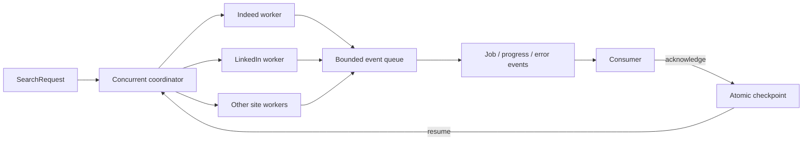

# JobStreaming

**Concurrent, resumable job collection for Python.**

JobStreaming collects and normalizes listings from multiple job boards, yielding each
result as soon as its source returns it. Concurrent adapters, typed events, durable
checkpoints, and stable job identities make it suitable for scripts, data pipelines,
background workers, workflow engines, and job-market analysis.

It is a standalone Python package: no companion service or database is required. Some
board adapters require operator-provided board credentials; the package does not ship
shared credentials. Use the full event stream for durable ingestion, a job-only
iterator for simple consumers, or the optional DataFrame API for batch analysis.

JobStreaming is an independently maintained, heavily modified fork of an MIT-licensed
upstream project. It retains the original license and attribution while using a
separate project, distribution, and import identity.

> **Alpha:** job boards change private endpoints and markup without notice. Treat every
> adapter as a best-effort integration, respect each site's terms and rate limits, and
> persist the events you need. Adapter availability can drift between releases, and
> the project provides no uptime, compatibility, or support-response SLA.

## What it provides

- Searches run concurrently across sites; a slow or blocked site does not hold back
  healthy sites.
- Jobs, warnings, progress, site failures, and completion are typed events.
- JSON checkpoints make searches restartable with at-least-once delivery.
- Stable job identities and checkpointed deduplication prevent acknowledged jobs from
  being emitted again after a restart.
- Adapter failures are isolated. The batch API returns healthy partial results unless
  strict failure mode is requested.
- Requests and result models are immutable and validated.
- An optional `scrape_jobs(...) -> pandas.DataFrame` entry point for batch and
  analysis workflows.
- Adapters are registered through an extensible registry rather than a hard-coded
  dispatcher.

Choose the interface that matches your consumer:

| Need | API |
|---|---|
| Durable ingestion with progress, errors, and explicit acknowledgement | `stream_search` |
| A simple iterator of normalized jobs | `stream_jobs` |
| A Pandas DataFrame for notebooks, exports, or batch analysis | `scrape_jobs` with the `batch` extra |
| Application-owned checkpoint persistence | `CheckpointStore` |
| Replacing or extending source behavior | `AdapterRegistry` |



## Installation

Python 3.10 through Python 3.14 are tested.

Install the published package from PyPI:

```bash
pip install -U jobstreaming
```

The default installation contains the streaming runtime and does not install or import
Pandas. Install the optional batch surface when you need DataFrames:

```bash
pip install -U "jobstreaming[batch]"
```

Both the PyPI distribution and Python import package are `jobstreaming`. No legacy
import alias or host application is required.

## Board credentials and TLS configuration

JobStreaming does not embed reusable board credentials or fallback tokens. Configure
only the adapters you are authorized to use, preferably through a process-level secret
manager:

| Adapter | Configuration | Behavior when absent |
|---|---|---|
| Indeed | `JOBSTREAMING_INDEED_API_KEY` | Emits `authentication_configuration`. |
| Naukri | `JOBSTREAMING_NAUKRI_NKPARAM` | Emits `authentication_configuration`. |
| ZipRecruiter | `JOBSTREAMING_ZIPRECRUITER_AUTHORIZATION` | Emits `authentication_configuration`. |
| Glassdoor | Discovers a live CSRF token; optional fallback `JOBSTREAMING_GLASSDOOR_CSRF_TOKEN` | Emits `authentication_configuration` if discovery fails and no configured token exists. |

ZipRecruiter also accepts optional
`JOBSTREAMING_ZIPRECRUITER_DEVICE_ID`,
`JOBSTREAMING_ZIPRECRUITER_PUSH_NOTIFICATION_ID`, and
`JOBSTREAMING_ZIPRECRUITER_ZVA_OVERRIDE` values when your authorized integration
requires them. Never commit these values or include them in fixtures, logs, issues, or
checkpoint files.

`ca_cert` is supported by adapters built on `requests`. Glassdoor and ZipRecruiter use
`tls-client`, whose current Python API cannot consume a custom CA bundle; those
adapters raise `AuthenticationConfigurationError` when `ca_cert` is supplied instead
of silently ignoring it. Use system trust, a correctly configured proxy, or a custom
requests-based adapter when a private CA is required.

## Stream results immediately

```python
from jobstreaming import ErrorEvent, JobEvent, SearchCompleteEvent, stream_search

with stream_search(
    site_name=["indeed", "linkedin", "zip_recruiter"],
    search_term="software engineer",
    location="Madrid",
    results_wanted=20,  # per site
    checkpoint_path=".jobstreaming/search.json",
    resume=True,
    ack_mode="explicit",
) as stream:
    for event in stream:
        if isinstance(event, JobEvent):
            print(event.site.value, event.job.title, event.job.job_url)

            # Persist the job first when durability matters, then explicitly ack it.
            save_to_database(event.job)

        elif isinstance(event, ErrorEvent):
            print(f"{event.site.value} failed: {event.message}")

        elif isinstance(event, SearchCompleteEvent):
            print("all sites completed:", event.completed)

        stream.ack(event)
```

Each site runs in its own worker. Arrival order is intentionally unspecified: faster
sites and faster pages yield first.

For a job-only iterator:

```python
from jobstreaming import stream_jobs

for job in stream_jobs(
    site_name=["indeed", "google"],
    search_term="data engineer",
    location="Barcelona",
    results_wanted=10,
):
    print(job.title)
```

Use `stream_search` when you need errors, progress, source-site metadata, or explicit
checkpoint acknowledgements.

## Restart and delivery semantics

Checkpointing is opt-in. Pass either `checkpoint_path` or a custom `CheckpointStore`.

- The default `ack_mode="implicit"` preserves the convenient behavior where requesting
  the next event acknowledges the previous event.
- Use `ack_mode="explicit"` for durable consumers. In this mode, requesting another
  event before `stream.ack(event)` raises `UnacknowledgedEventError` and does not advance
  the checkpoint.
- Call `stream.ack(event)` after a durable write when you need the checkpoint advanced
  immediately.
- Leaving the context manager early does not acknowledge the last delivered event;
  call `stream.ack(event)` first when an intentional early stop should be committed.
- If execution stops before acknowledgement, that job can be replayed on restart. This
  is at-least-once delivery: it favors avoiding data loss over pretending exactly-once
  delivery is possible.
- Acknowledged jobs are deduplicated with stable, process-independent keys.
- Page and cursor state advances only after the corresponding progress event is
  acknowledged.
- Only failures classified as `transient_network` or `rate_limited` are retried by
  default. Configure `max_retries` and `retry_backoff` on `stream_search` or
  `scrape_jobs`. `max_retries` means coordinator retries after the initial adapter
  attempt; adapters do not hide additional transport retries.
- Valid `Retry-After` delta or HTTP-date values on retryable board responses are
  honored, capped at five minutes. The selected delay is the larger of `Retry-After`
  and exponential `retry_backoff`.
- The checkpoint is written through an `fsync` plus atomic file replacement.
- Checkpoints carry an overall schema version, a monotonically increasing revision, and
  a cursor-state schema version for every adapter. An incompatible library or adapter
  upgrade raises `CheckpointCompatibilityError` before any board worker starts.
- A checkpoint is bound to the complete request fingerprint. Changing the query,
  filters, sites, or result count raises `CheckpointMismatchError`; use a new path or
  `resume=False` for a new search.
- Board-owned cursors can expire. If a board rejects an old cursor, the stream emits an
  `ErrorEvent` with `code="cursor_expired"` and `reset_checkpoint=True`; restart that
  site from a fresh checkpoint.
- Custom stores can provide compare-and-swap ownership using `checkpoint.revision`.
  Raise `CheckpointConflictError` for a stale save; the conflict is surfaced to the
  caller immediately and the stream stops without advancing its local checkpoint.

If a process crashes while handling a job, replay is expected. Make downstream writes
idempotent using `event.job_key` or the job's stable `id`.

## Compatible batch API

Install `jobstreaming[batch]` before using this compatibility API:

```python
from jobstreaming import scrape_jobs

jobs = scrape_jobs(
    site_name=["indeed", "linkedin", "zip_recruiter", "google"],
    search_term="software engineer",
    google_search_term="software engineer jobs near Madrid since yesterday",
    location="Madrid",
    results_wanted=20,
    hours_old=72,
    country_indeed="Spain",
)

jobs.to_csv("jobs.csv", index=False)
```

`scrape_jobs` consumes the same concurrent event stream and returns a DataFrame. By
default, a failed site is logged and healthy partial results are returned. Set
`raise_on_error=True` to raise after all sites have had a chance to finish.
Calling it from a core-only installation raises
`MissingOptionalDependencyError` before any adapter or network work begins, with the
exact extra needed to enable it.

Checkpoints store identities and cursor state, not full job payloads. A resumed batch
call therefore contains only jobs emitted during that invocation. For a durable full
result set across restarts, use `stream_search` and upsert each `JobEvent` into your own
store before acknowledging it.

## Salary provenance and description inference

Structured compensation returned by a board is authoritative and is never replaced by
description text. Normalized jobs attach `salary_provenance` with the source,
confidence, and—only for description-derived values—the matched evidence snippet:

- `direct_data` is high confidence.
- Board-provided `estimated` compensation is medium confidence.
- Description-derived compensation is medium confidence and must be enabled
  explicitly.

Description inference is off by default. This replaces the earlier implicit US-only
heuristic, which guessed an interval from numeric thresholds. Opt in per request:

```python
from jobstreaming import DescriptionSalaryPolicy, stream_jobs

jobs = stream_jobs(
    site_name="google",
    search_term="platform engineer",
    country_indeed="Spain",
    description_salary_policy=DescriptionSalaryPolicy.CONSERVATIVE,
)
```

The conservative parser requires a nearby compensation cue, a range, an explicit pay
interval, and an explicit or country-resolved currency. It handles common English,
Spanish, Catalan, French, German, Portuguese, and Italian compensation and interval
terms plus localized thousands/decimal separators. Ambiguous dollar symbols are
resolved only for USD, CAD, AUD, or NZD request countries; bonuses, commissions,
equity, budgets, costs, revenue, contract values, missing intervals, and reversed
ranges are rejected. `enforce_annual_salary=True` annualizes accepted compensation
without changing its provenance.

The batch schema exposes flattened `salary_source`, `salary_confidence`, and
`salary_evidence` columns alongside `interval`, `min_amount`, `max_amount`, and
`currency`.

## Events

`stream_search` can yield:

| Event | Meaning |
|---|---|
| `JobEvent` | One normalized job is ready. |
| `ProgressEvent` | A restart boundary such as a page or cursor was completed. |
| `WarningEvent` | A listing was skipped or a requested filter is unsupported. |
| `ErrorEvent` | A site failed; other sites continue. |
| `SiteCompleteEvent` | One site exhausted its work or reached its result limit. |
| `SearchCompleteEvent` | Every worker stopped. `completed=False` means at least one site failed. |

`ErrorEvent.code` is a stable `ErrorCode` value. `retryable` tells an operator whether
the same board operation can be retried, while `reset_checkpoint` tells them whether
the board cursor should be discarded first. `retry_after` preserves a valid, bounded
board-requested delay on a retryable terminal failure.

| Error code | Retry | Reset board checkpoint |
|---|---:|---:|
| `transient_network` | yes | no |
| `rate_limited` | yes | no |
| `invalid_request` | no | no |
| `cursor_expired` | no | yes |
| `authentication_configuration` | no | no |
| `cancelled` | no | no |
| `adapter_failure` | no | no |

## Cancellation

Supply a `threading.Event`, a callback, or both. Queue waits, retry backoff, and blocked
adapter/network operations are observed through the same cancellation boundary.
`close()` also wakes a consumer blocked in `next()`. Cancellation is monotonic: after
an event is set or a callback returns `True` once, that stream remains cancelled and
cannot later report a healthy completion.

```python
from threading import Event

from jobstreaming import StreamCancelledError, stream_search

cancel = Event()

try:
    with stream_search(
        site_name=["indeed", "linkedin"],
        search_term="platform engineer",
        cancel_event=cancel,
        # cancel_callback=lambda: shutdown_requested(),  # optional alternative
    ) as stream:
        for event in stream:
            process(event)
except StreamCancelledError:
    pass
```

## Supported sites and important limits

| Site | Restart boundary | Notes |
|---|---|---|
| Indeed | cursor/page | Requires `JOBSTREAMING_INDEED_API_KEY`. `hours_old`, `easy_apply`, and `job_type`/`is_remote` are mutually exclusive in the upstream API. |
| LinkedIn | result offset/page | Full descriptions require `linkedin_fetch_description=True` and add one request per job. Aggressive rate limiting is common. |
| ZipRecruiter | continuation token | Requires `JOBSTREAMING_ZIPRECRUITER_AUTHORIZATION`. US and Canada are the primary supported markets. |
| Glassdoor | page/cursor | Uses live CSRF discovery or explicitly configured fallback. A location is required unless `is_remote=True`. Availability depends on `country_indeed`. |
| Google Jobs | cursor | `google_search_term` can override the generated query. The upstream response format is opaque and fragile. |
| Bayt | page | Currently supports keyword search and international results. |
| Naukri | page | Requires `JOBSTREAMING_NAUKRI_NKPARAM`. India-focused. A non-empty `search_term` is required. |
| BDJobs | page | Bangladesh-focused. Detail pages are fetched concurrently within each result page. |

Adapters declare their supported filter names and, for enum filters such as
`job_type`, supported values. If a selected adapter cannot honor a requested filter or
value, the stream emits a `WarningEvent` and omits the parameter instead of silently
implying that it was applied.

## Validated request API

For reusable searches, construct an immutable request explicitly:

```python
from jobstreaming import Country, SearchRequest, Site, stream_search

request = SearchRequest(
    site_type=(Site.INDEED, Site.LINKEDIN),
    search_term="platform engineer",
    location="Madrid",
    country=Country.SPAIN,
    results_wanted=25,
    request_timeout=20,
    max_pages=10,
)

with stream_search(request, checkpoint_path="search.json") as stream:
    for event in stream:
        ...
```

Negative offsets/result counts, invalid timeouts, malformed compensation ranges, empty
job titles/URLs, and unsupported enum values are rejected at the boundary.

## Custom adapters

The adapter SDK uses five domain terms:

- **Adapter identifier**: a stable `AdapterId` for a custom source; built-in sources
  continue to use `Site`.
- **Search filter**: a `SearchFilter` the source genuinely applies.
- **Resume support**: either `NoResume` or `Resumable` with an open, validated
  `ResumeGranularity` value and cursor schema version.
- **Adapter**: the structural `Adapter` protocol; inheritance is optional.
- **Adapter test kit**: offline helpers that validate construction, identity, and
  fixture-driven resume behavior without requiring pytest at runtime.

```python
from jobstreaming import (
    AdapterCapabilities,
    AdapterId,
    AdapterRegistry,
    AdapterTestKit,
    JobResponse,
    Resumable,
    ResumeGranularity,
    SearchFilter,
    stream_search,
)

class InternalJobs:
    identifier = AdapterId("company.internal_jobs")
    capabilities = AdapterCapabilities(
        filters=frozenset({SearchFilter.SEARCH_TERM}),
        resume=Resumable(
            granularity=ResumeGranularity.CURSOR,
            cursor_schema_version=1,
        ),
    )

    def __init__(self, proxies=None, ca_cert=None, user_agent=None, **kwargs):
        self.site = self.identifier

    def scrape(self, request, context=None):
        for job in fetch_internal_jobs(request):
            context.emit_job(job, {"cursor": job.id})
        return JobResponse()

registry = AdapterRegistry()
registry.register(InternalJobs.identifier, InternalJobs)
AdapterTestKit.assert_conforms(InternalJobs.identifier, InternalJobs)

with stream_search(
    site_name=InternalJobs.identifier,
    registry=registry,
    search_term="engineer",
) as stream:
    for event in stream:
        ...
```

Increment `cursor_schema_version` whenever a deployed adapter can no longer interpret
cursor state written by its previous implementation. Custom identifiers are validated,
serialized as strings in requests/events/checkpoints, and must not collide with a
built-in `Site`. Resume granularities are also open to third-party values; spaces and
hyphens normalize to underscores, so the legacy `"continuation token"` value becomes
`ResumeGranularity("continuation_token")`.

`Site` arguments and built-in site strings remain compatible. The legacy
`supports_resume` / `resume_granularity` constructor fields still parse with a
`DeprecationWarning`; migrate to `resume=Resumable(...)` or `resume=NoResume()`.
Adapters must expose `AdapterCapabilities`, and factories that declare capabilities
must produce the same value. An ordinary function factory may omit a class-level
declaration; registration then uses a provisional cursor schema version of 1 (or an
explicit deprecated registration value) and validates the first produced instance
before scraping. A discovered resume-schema mismatch fails instead of writing an
incompatible checkpoint.

Adapters should implement `scrape(request, context=None)`. Runtime execution no longer
inspects method signatures. Registration temporarily detects the old
`scrape(request)` form and warns; use `legacy_adapter(factory)` as an explicit
non-resumable bridge while migrating. That bridge preserves declared filters and
job-type support while disabling resume. Implicit legacy detection is scheduled for
removal in 1.0.

The distribution includes `py.typed`, so consumers can type-check protocol
implementations and capability declarations.

## Development

```bash
poetry install --all-extras
poetry run pytest --cov
poetry run python scripts/check_coverage.py
poetry run ruff check jobstreaming tests scripts
poetry run mypy
poetry run black --check jobstreaming tests scripts
poetry build
python scripts/verify_release_artifacts.py \
  --expected-version "$(poetry version --short)" \
  --dist-dir dist
```

The test suite is offline: it validates domain invariants, concurrency, failure
isolation, acknowledgement/replay behavior, checkpoint persistence, compatibility, and
representative adapter parsing without calling live job boards.

The separate `Adapter live canary` workflow is opt-in and never runs as part of pull
request CI. Set the repository variable `JOBSTREAMING_CANARY_ENABLED=true`, configure
`JOBSTREAMING_CANARY_SITES` as a comma-separated list of boards you are authorized to
query, and add only the corresponding `JOBSTREAMING_*` repository secrets. Optional
`JOBSTREAMING_CANARY_QUERY` and `JOBSTREAMING_CANARY_LOCATION` variables keep the
minimal one-result queries stable. An unconfigured workflow exits successfully without
contacting any board, and its output contains only board names and aggregate status.

## Support and security

Use [GitHub issues](https://github.com/ebarti/jobstreaming/issues) for reproducible
bugs, adapter drift reports, and non-sensitive support questions. Include the
JobStreaming version, selected adapter, sanitized error event, and an offline
reproduction when possible.

Do not place credentials or vulnerability details in an issue. See
[SECURITY.md](https://github.com/ebarti/jobstreaming/blob/main/SECURITY.md) for private
reporting and supported-version policy, and
[CONTRIBUTING.md](https://github.com/ebarti/jobstreaming/blob/main/CONTRIBUTING.md)
before submitting a change. Release history is in
[CHANGELOG.md](https://github.com/ebarti/jobstreaming/blob/main/CHANGELOG.md), and the
maintainer release contract is in
[RELEASING.md](https://github.com/ebarti/jobstreaming/blob/main/RELEASING.md).

## License and attribution

MIT. The retained license identifies Cullen Watson as the original copyright holder.
This rebuild is independently maintained and is not affiliated with the original
creator or any supported job board.
