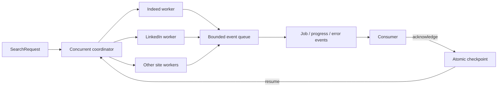

# JobStream

JobStream is the concurrent, restartable job-collection library for JobCtrl. Its
primary API yields each job as soon as its adapter produces it, while retaining a
convenient DataFrame batch API.

This project is a heavily modified private fork of an MIT-licensed upstream project.
It retains the original license and attribution while using a completely separate
project, distribution, and import identity.

> **Alpha:** job boards change private endpoints and markup without notice. Treat every
> adapter as a best-effort integration, respect each site's terms and rate limits, and
> persist the events you need.

## What changed

- Searches run concurrently across sites; a slow or blocked site does not hold back
  healthy sites.
- Jobs, warnings, progress, site failures, and completion are typed events.
- JSON checkpoints make searches restartable with at-least-once delivery.
- Stable job identities and checkpointed deduplication prevent acknowledged jobs from
  being emitted again after a restart.
- Adapter failures are isolated. The batch API returns healthy partial results unless
  strict failure mode is requested.
- Requests and result models are immutable and validated.
- A `scrape_jobs(...) -> pandas.DataFrame` entry point remains available.
- Adapters are registered through an extensible registry rather than a hard-coded
  dispatcher.



## Installation

Python 3.10 or newer is required.

Install the published package from PyPI:

```bash
pip install -U jobstream
```

The distribution is `jobstream` and the Python package is `jobstream`. No legacy
import alias is included. The source repository remains private; PyPI releases are
performed explicitly from verified distribution artifacts.

## Stream results immediately

```python
from jobstream import ErrorEvent, JobEvent, SearchCompleteEvent, stream_search

with stream_search(
    site_name=["indeed", "linkedin", "zip_recruiter"],
    search_term="software engineer",
    location="Madrid",
    results_wanted=20,  # per site
    checkpoint_path=".jobstream/search.json",
    resume=True,
) as stream:
    for event in stream:
        if isinstance(event, JobEvent):
            print(event.site.value, event.job.title, event.job.job_url)

            # Persist the job first when durability matters, then explicitly ack it.
            save_to_database(event.job)
            stream.ack(event)

        elif isinstance(event, ErrorEvent):
            print(f"{event.site.value} failed: {event.message}")

        elif isinstance(event, SearchCompleteEvent):
            print("all sites completed:", event.completed)
```

Each site runs in its own worker. Arrival order is intentionally unspecified: faster
sites and faster pages yield first.

For a job-only iterator:

```python
from jobstream import stream_jobs

for job in stream_jobs(
    site_name=["indeed", "google"],
    search_term="data engineer",
    location="Barcelona",
    results_wanted=10,
):
    print(job.title)
```

Use `stream_search` when you need errors, progress, source-site metadata, or explicit
checkpoint acknowledgements.

## Restart and delivery semantics

Checkpointing is opt-in. Pass either `checkpoint_path` or a custom `CheckpointStore`.

- A delivered event is implicitly acknowledged when the next event is requested.
- Call `stream.ack(event)` after a durable write when you need the checkpoint advanced
  immediately.
- Leaving the context manager early does not acknowledge the last delivered event;
  call `stream.ack(event)` first when an intentional early stop should be committed.
- If execution stops before acknowledgement, that job can be replayed on restart. This
  is at-least-once delivery: it favors avoiding data loss over pretending exactly-once
  delivery is possible.
- Acknowledged jobs are deduplicated with stable, process-independent keys.
- Page and cursor state advances only after the corresponding progress event is
  acknowledged.
- Recoverable adapter failures are retried once by default with exponential backoff.
  Configure `max_retries` and `retry_backoff` on `stream_search` or `scrape_jobs`.
- The checkpoint is written through an `fsync` plus atomic file replacement.
- A checkpoint is bound to the complete request fingerprint. Changing the query,
  filters, sites, or result count raises `CheckpointMismatchError`; use a new path or
  `resume=False` for a new search.
- Board-owned cursors can expire. If a board rejects an old cursor, the stream emits an
  `ErrorEvent`; restart that site from a fresh checkpoint.

If a process crashes while handling a job, replay is expected. Make downstream writes
idempotent using `event.job_key` or the job's stable `id`.

## Compatible batch API

```python
from jobstream import scrape_jobs

jobs = scrape_jobs(
    site_name=["indeed", "linkedin", "zip_recruiter", "google"],
    search_term="software engineer",
    google_search_term="software engineer jobs near Madrid since yesterday",
    location="Madrid",
    results_wanted=20,
    hours_old=72,
    country_indeed="Spain",
)

jobs.to_csv("jobs.csv", index=False)
```

`scrape_jobs` consumes the same concurrent event stream and returns a DataFrame. By
default, a failed site is logged and healthy partial results are returned. Set
`raise_on_error=True` to raise after all sites have had a chance to finish.

Checkpoints store identities and cursor state, not full job payloads. A resumed batch
call therefore contains only jobs emitted during that invocation. For a durable full
result set across restarts, use `stream_search` and upsert each `JobEvent` into your own
store before acknowledging it.

## Events

`stream_search` can yield:

| Event | Meaning |
|---|---|
| `JobEvent` | One normalized job is ready. |
| `ProgressEvent` | A restart boundary such as a page or cursor was completed. |
| `WarningEvent` | A listing was skipped or a requested filter is unsupported. |
| `ErrorEvent` | A site failed; other sites continue. |
| `SiteCompleteEvent` | One site exhausted its work or reached its result limit. |
| `SearchCompleteEvent` | Every worker stopped. `completed=False` means at least one site failed. |

## Supported sites and important limits

| Site | Restart boundary | Notes |
|---|---|---|
| Indeed | cursor/page | `hours_old`, `easy_apply`, and `job_type`/`is_remote` are mutually exclusive in the upstream API. |
| LinkedIn | result offset/page | Full descriptions require `linkedin_fetch_description=True` and add one request per job. Aggressive rate limiting is common. |
| ZipRecruiter | continuation token | US and Canada are the primary supported markets. |
| Glassdoor | page/cursor | A location is required unless `is_remote=True`. Availability depends on `country_indeed`. |
| Google Jobs | cursor | `google_search_term` can override the generated query. The upstream response format is opaque and fragile. |
| Bayt | page | Currently supports keyword search and international results. |
| Naukri | page | India-focused. A non-empty `search_term` is required. |
| BDJobs | page | Bangladesh-focused. Detail pages are fetched concurrently within each result page. |

Adapters declare their supported filters. If a selected adapter cannot honor a
requested filter, the stream emits a `WarningEvent` instead of silently implying that
the filter was applied.

## Validated request API

For reusable searches, construct an immutable request explicitly:

```python
from jobstream import Country, SearchRequest, Site, stream_search

request = SearchRequest(
    site_type=(Site.INDEED, Site.LINKEDIN),
    search_term="platform engineer",
    location="Madrid",
    country=Country.SPAIN,
    results_wanted=25,
    request_timeout=20,
    max_pages=10,
)

with stream_search(request, checkpoint_path="search.json") as stream:
    for event in stream:
        ...
```

Negative offsets/result counts, invalid timeouts, malformed compensation ranges, empty
job titles/URLs, and unsupported enum values are rejected at the boundary.

## Custom adapters

```python
from jobstream import AdapterRegistry, JobResponse, Scraper, Site, stream_search

class InternalJobs(Scraper):
    def __init__(self, **kwargs):
        super().__init__(Site.INDEED)  # this example replaces the Indeed adapter

    def scrape(self, request, context=None):
        for job in fetch_internal_jobs(request):
            context.emit_job(job, {"cursor": job.id})
        return JobResponse()

registry = AdapterRegistry()
registry.register(Site.INDEED, InternalJobs)

with stream_search(
    site_name="indeed",
    registry=registry,
    search_term="engineer",
) as stream:
    for event in stream:
        ...
```

Legacy adapters that only return `JobResponse` are still accepted, but their results
cannot be streamed until that adapter returns.

The registry can replace any built-in adapter. Adding an entirely new site also
requires adding that board to the `Site` enum so it participates in validation,
fingerprinting, events, and checkpoints.

## Development

```bash
poetry install
poetry run pytest
poetry run ruff check jobstream tests
poetry run black --check jobstream tests
poetry build
```

The test suite is offline: it validates domain invariants, concurrency, failure
isolation, acknowledgement/replay behavior, checkpoint persistence, compatibility, and
representative adapter parsing without calling live job boards.

## License and attribution

MIT. The retained license identifies Cullen Watson as the original copyright holder.
This rebuild is independently maintained and is not affiliated with the original
creator or any supported job board.
